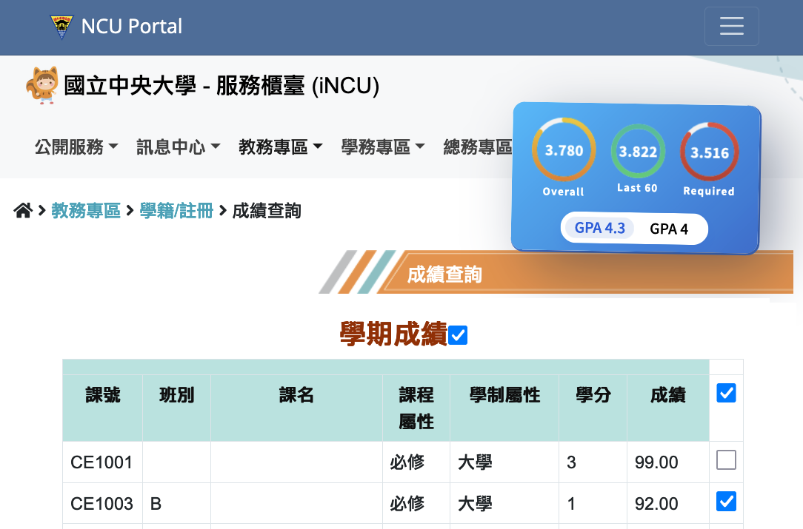

# 國立中央大學 GPA 計算機 GPA Calculator for NCU

[![Badge Submit to Web Store]][Submit to Web Store]
[![Badge Stars]][Stars]
[![Badge Commit]][Commit]
[![Badge Issues]][Issues]
[![Badge PRs Welcome]][PRs Welcome]
[![Badge License]][License]



<table>
  <thead>
    <tr>
      <th align="center" >Userscript (Recommend)</th>
      <th align="center" >Google Chrome / Microsoft Edge</th>
      <th align="center" >Firefox</th>
    </tr>
  </thead>
  <tbody>
    <tr>
      <td align="center">
        <a href="https://github.com/cliffxzx/gpa-calculator-for-ncu/raw/main/build/userscript-prod/gpa-calculator-for-ncu.user.js">
          
        </a>
      </td>
      <td align="center" width="300">
        <a href="https://chrome.google.com/webstore/detail/gpa-calculator-for-ncu/icfdhijcdkomkgibcbjbmenjkcfalljj">
          
        </a>
      </td>
      <td align="center">
        <a href="https://addons.mozilla.org/en-US/firefox/addon/gpa-calculator-for-ncu">
          
        </a>
        <br />
        <a href="https://github.com/cliffxzx/gpa-calculator-for-ncu/raw/main/build/firefox-mv2-prod/web-ext-artifacts/gpa_calculator_for_ncu-0.1.1.3.xpi">Manual Install</a>
      </td>
      <!-- <td align="center" width="140">
        <a href="https://chrome.google.com/webstore/detail/icfdhijcdkomkgibcbjbmenjkcfalljj">
          
        </a>
      </td> -->
    </tr>
  <tbody>
</table>

As the Score system has been migrated to the new one, the old GPA calculators are no longer functional. This extension serves as a replacement for the old calculators. It is currently undergoing rapid development and may contain some bugs. If you come across any bugs, please report them. We highly encourage you to submit a pull request for any new features. Thank you!

由於舊的 GPA 計算機擴充功能因為成績系統的改版而失效，因此開發了這個新的擴充功能來取代舊的計算機。目前這個擴充功能還在快速開發中，可能會有一些 bug。我們也非常歡迎你提交新功能的 pull request。如果你覺得這個擴充功能對你有幫助，給一顆星星。謝謝！

## Features

- ⌨️ 2 metrics x 3 range options = [GPA4, GPA4.3] X [Overall, Last 60, Required]

## Disclaimer

This extension is for estimation only, and is not responsible for any loss or damage.

此擴充功能僅提供概估 GPA 分數，不負任何損失責任。

## Credits

- [Browser Extension Starter](https://github.com/utags/browser-extension-starter)

## Developer Guideline

### Browser Extension Starter and Userscript Starter

#### Features

- One codebase for Chrome extesions, Firefox addons, Userscripts, Bookmarklets and simple JavaScript modules
- Live-reload and React HMR
- [Plasmo](https://www.plasmo.com/) - The Browser Extension Framework
- [esbuild](https://esbuild.github.io/) - Bundler
- React
- TypeScript
- [Prettier](https://github.com/prettier/prettier) - Code Formatter
- [XO](https://github.com/xojs/xo) - JavaScript/TypeScript linter

#### Showcases

- [UTags - Add usertags to links](https://github.com/utags/utags) - Allow users to add custom tags to links.
- [Hacker News Apps Switcher](https://github.com/dev-topics-only/hacker-news-apps-switcher) - Open Hacker News links on the favorite apps

#### How To Make A New Extension

1. Fork [this starter repo](https://github.com/utags/browser-extension-starter), and rename repo to your extension name

2. Clone your repo

3. Install dependencies

```bash
pnpm install
### or
npm install
```

#### Getting Started

First, run the development server:

```bash
pnpm dev
### or
npm run dev
```

Open your browser and load the appropriate development build. For example, if you are developing for the chrome browser, using manifest v3, use: `build/chrome-mv3-dev`.

You can start editing the popup by modifying `popup.tsx`. It should auto-update as you make changes. To add an options page, simply add a `options.tsx` file to the root of the project, with a react component default exported. Likewise to add a content page, add a `content.ts` file to the root of the project, importing some module and do some logic, then reload the extension on your browser.

For further guidance, [visit our Documentation](https://docs.plasmo.com/)

#### Making production build

Run the following:

```bash
pnpm build
### or
npm run build
```

This should create a production bundle for your extension, ready to be zipped and published to the stores.

#### Submit to the webstores

The easiest way to deploy your Plasmo extension is to use the built-in [bpp](https://bpp.browser.market) GitHub action. Prior to using this action however, make sure to build your extension and upload the first version to the store to establish the basic credentials. Then, simply follow [this setup instruction](https://docs.plasmo.com/framework/workflows/submit) and you should be on your way for automated submission!

#### License

Copyright (c) 2023 [Pipecraft](https://www.pipecraft.net). Licensed under the [MIT License](LICENSE).

#### >\_

[](https://www.pipecraft.net)
[](https://utags.pipecraft.net)
[](https://dto.pipecraft.net)
[](https://www.bestxtools.com)

<!----------------------------------[ Links ]--------------------------------->

[Submit to Web Store]: https://github.com/cliffxzx/gpa-calculator-for-ncu/actions/workflows/submit.yml/badge.svg?branch=main
[PRs Welcome]: https://github.com/cliffxzx/gpa-calculator-for-ncu/compare
[Stars]: https://github.com/cliffxzx/gpa-calculator-for-ncu/stargazers
[Commit]: https://github.com/cliffxzx/gpa-calculator-for-ncu/commits/main
[Issues]: https://github.com/cliffxzx/gpa-calculator-for-ncu/issues
[License]: https://github.com/cliffxzx/gpa-calculator-for-ncu/blob/main/LICENSE

<!----------------------------------[ Badges ]--------------------------------->

[Badge Submit to Web Store]: https://github.com/cliffxzx/gpa-calculator-for-ncu/actions/workflows/submit.yml/badge.svg?branch=main
[Badge PRs Welcome]: https://img.shields.io/badge/PRs-welcome-brightgreen.svg
[Badge Stars]: https://img.shields.io/github/stars/cliffxzx/gpa-calculator-for-ncu
[Badge Commit]: https://img.shields.io/github/commit-activity/m/cliffxzx/gpa-calculator-for-ncu?label=Commits
[Badge Issues]: https://img.shields.io/github/issues/cliffxzx/gpa-calculator-for-ncu
[Badge License]: https://img.shields.io/github/license/cliffxzx/gpa-calculator-for-ncu
[Badge Chrome]: https://img.shields.io/chrome-web-store/rating/icfdhijcdkomkgibcbjbmenjkcfalljj?label=Chrome

[Badge Mozilla]: https://img.shields.io/amo/rating/[name-of-ext]?label=Firefox
[Badge Edge]: https://img.shields.io/badge/dynamic/json?label=Edge&color=brightgreen&query=%24.averageRating&suffix=%2F%35&url=https%3A%2F%2Fmicrosoftedge.microsoft.com%2Faddons%2Fgetproductdetailsbycrxid%2F[ext-id]
